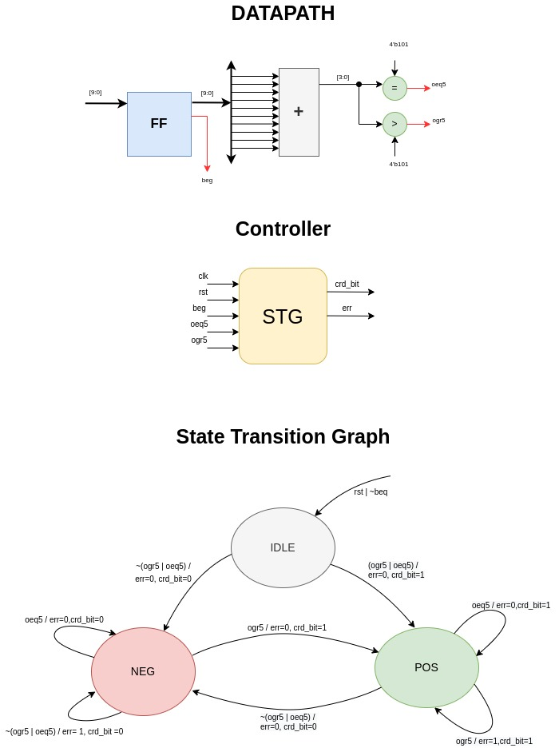

# pcie-crd
Current Running Disparity calculator for the physical layer of PCI Express.

## I/Os 
The top level design has the following input and outputs

**Inputs**\
10-bits input data that is given to Disparity calculator
> [9:0] data_in 

Clock and reset signals
>clk \
>rst

**Outputs**\
Current running disparity bit that represents the positive and negative disparity when it is 1 and 0 respectively.
>crd_bit

An error signal to indicate the overlapping positive and negative disparity.
>err

**Control Signals**\
Some control signals coming from datapath to state machine.
>oeq5\
>ogr5\
>beg

## Datapath and Controller
The following figure demonstrate the complete design implemented in verilog.

